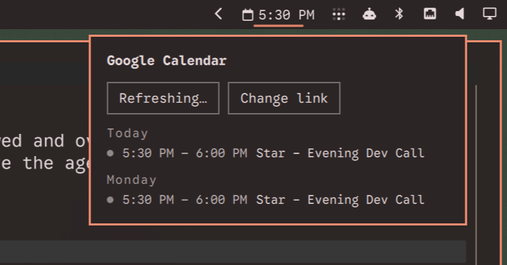

# Google Calendar Events

An [Omarchy](https://omarchyplugins.com) bar widget that shows your next
Google Calendar event and an agenda popup — no OAuth, no Google Cloud
project. It reads your calendar's private iCal feed URL over plain HTTPS.

- Bar pill stays quiet until it matters: just the icon when nothing's due
  today, icon + bare time once it's today, and icon + title + countdown
  (`in 12m`, `· now`) only in the last hour before an event — urgent-colored
  inside the last 5 minutes.
- Click the pill for an agenda grouped by day (Today / Tomorrow / weekday).
- Right-click opens Google Calendar in your browser. Middle-click forces a
  refresh.
- Recurring events (daily standups, "2nd Friday" meetings, yearly
  birthdays, edited single occurrences) are expanded locally.
- One-click **Join** link next to events with a Google Meet, Zoom, Teams,
  or Webex link.
- Long titles elide rather than stretch the bar — hover the pill or an
  agenda row to scroll through the full title.



## Installation

```sh
omarchy plugin add https://github.com/0xRichardH/omarchy-gcal-events.git --enable
```

This clones the plugin into `~/.config/omarchy/plugins/0xrichardh.gcal-events/`
and enables it in your bar. To remove it later:

```sh
omarchy plugin remove 0xrichardh.gcal-events
```

## Setup

Google Calendar can hand out a **secret address in iCal format** for any
calendar you own — a plain HTTPS link that always returns your current
events. That link *is* the auth; there's no sign-in flow to build.

1. Click the bar pill (it'll be in setup mode on first run) and click
   **Open Google Calendar settings** — it opens straight to **Integrate
   calendar**.
2. Pick the right calendar in the left sidebar if you have more than one.
3. Copy the **Secret address in iCal format** — not the **Public address**
   just above it, which only works if the calendar is public.
4. Paste it into the setup form and hit **Save**.

Two things worth knowing before you start:

- **Treat that link like a password.** Anyone who has it can read your
  whole calendar, including private events. It's stored at
  `~/.local/state/omarchy/plugins/0xrichardh.gcal-events/feed-url.txt`
  with `600` permissions — not in `shell.json`, and never passed as a
  command-line argument (saving and fetching pipe the secret via stdin
  to avoid disclosing it in `ps`).
- **This isn't real-time.** Google caches the feed server-side; changes
  usually show up within a few hours, not seconds. Good for "what's next,"
  not for a live meeting-in-progress indicator.
- **Workspace accounts**: some admins disable the secret address entirely.
  If you don't see that option, ask your admin.
- **Shared/subscribed calendars** you don't own often don't expose a
  secret address either — this works best on a calendar you own.

If the link ever leaks, click **Reset** next to it in Google Calendar
settings to invalidate it, then paste the new one in via "Change link" in
the popup.

## Settings

Available via the bar widget's settings (numbers only, no secrets go
here):

| Setting | Default | Notes |
|---|---|---|
| Refresh interval (seconds) | 300 | How often to re-fetch the feed. |
| Show events within (hours) | 72 | Agenda/lookahead window. |
| Max events in popup | 6 | Caps the agenda list length. |

## Known limitations

- **Timezones**: event times are treated as wall-clock time in the
  machine's local timezone, whether the ICS entry is floating, `Z` (UTC —
  this one is always exact), or carries a `TZID`. This matches reality
  when your calendar's timezone is the same as the machine running
  Omarchy (the common case for a personal calendar on your own desktop)
  and can drift otherwise. See the comment at the top of `Model.js`.
- **RRULE coverage**: `DAILY` / `WEEKLY` / `MONTHLY` / `YEARLY` with
  `INTERVAL`, `COUNT`, `UNTIL`, `BYDAY` (with ordinals for
  `MONTHLY`/`YEARLY`), `BYMONTHDAY`, `BYMONTH` — i.e. the recurrence
  shapes Google Calendar's own UI actually produces. `BYSETPOS`,
  `BYWEEKNO`, and sub-daily frequencies aren't implemented.
- Single calendar only. For multiple calendars, run the widget twice with
  different `allowMultiple`... actually not supported yet (`allowMultiple`
  is `false`); merging multiple feeds is a reasonable follow-up but out of
  scope for v1.

## Dependencies

`curl` and `bash` — both ship standard on Omarchy. No other packages,
services, or language runtimes required. `Model.js` is plain JavaScript
run inside the Quickshell QML engine; `tools/test-model.js` needs Node
only for running the test suite during development, not at runtime.

## Development

`Model.js` has no QML/Quickshell imports — all ICS parsing, RRULE
expansion, and formatting is plain, unit-testable JS. Run the test suite
with plain Node:

```sh
node tools/test-model.js
```

Structural/manifest checks:

```sh
omarchy plugin validate .
```

Local testing against your live bar: edit the files directly under
`~/.config/omarchy/plugins/0xrichardh.gcal-events/` (that's where
`omarchy plugin add` clones this repo to), then rescan:

```sh
omarchy-shell shell rescanPlugins
```

## License

MIT — see `LICENSE`.
